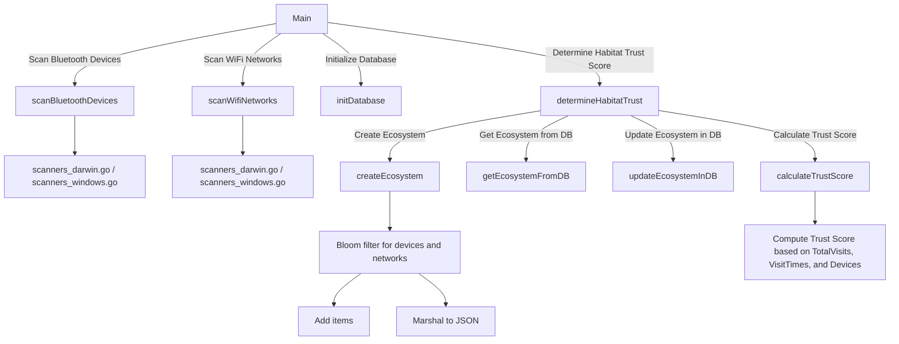

# Habitat (Trust Score)

[](https://github.com/rmcvey/habitat/actions/workflows/go.yml)

Habitat is an experimental project that aims to measure the level of trust in the digital environments or "habitats" that people occupy (aka [PAN](https://en.wikipedia.org/wiki/Personal_area_network)). These habitats can include personal spaces like home offices, workspaces, or even public places like airport terminals. The idea is that as users grow familiar with their digital surroundings, they develop trust in these environments. The motivation behind this project is to accommodate users who don't want to (or can't) use precise location data for authentication decisions but still desire some assurance that a device is not stolen or in an unfamiliar place. By quantifying trust based on the presence of known devices and networks in a privacy-preserving manner, we can reduce security friction and provide a more seamless user experience in familiar environments.

The Habitat Trust Score calculates a floating-point score between 1 and 10 for each habitat, representing the level of trust we should have in the device. This score is based on factors such as the number of known devices connected or nearby (Bluetooth) and the familiarity of the Wi-Fi networks in the environment.

## Architecture



## Optimization

We optimized our implementation to ensure privacy preservation, minimal disk space usage, and adaptability to changing environments. We've used a Bloom filter to represent unique combinations of connected and nearby devices, and a time decay approach to calculate trust scores based on the frequency of visits and the presence of familiar devices.

## Scoring Algorithm

The trust score is calculated using a weighted average of two components:

1. **Device Trust**: The proportion of known devices connected or nearby (Bluetooth) in the environment.
2. **Visit Trust**: A time decay approach that takes into account the frequency and recency of visits to the habitat.

The maximum possible trust score for the current number of visits is calculated using the time decay approach. The final trust score is then normalized to a range of 1.0 to 10.0.

Usage

1. First, install the necessary dependencies:

```go
go get github.com/mattn/go-sqlite3
go get github.com/willf/bloom
```

2. Compile and run the program:

```css
go build .
./habitat
```

The program will scan for nearby Bluetooth devices and Wi-Fi networks, calculate a trust score for the current habitat, and store the trust data in an SQLite database (trust_data.db). The trust score can then be used to inform authentication decisions and provide a more secure and seamless user experience in trusted environments.